Your answers to the questions go here.
# Torrance L. Gordon
# August - 2019

### Datadog Recruiting Candidate exercise results:  
***
### Collecting Metrics

**- Add tags in the Agent config file and show us a screenshot of your host and its tags on the Host Map page in Datadog.**  
  
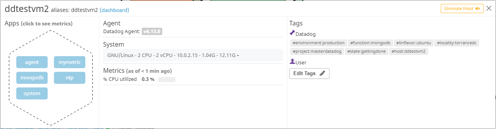  

**- Install a database on your machine (MongoDB, MySQL, or PostgreSQL) and then install the respective Datadog integration for that database.**
 
I used the ubuntu vagrant image and apt install mongodb on the client server. Datadog integration built in so I only had to turn on/configure.

See partialconf.yml file uploaded to see some of the lines added or modified.

**- Create a custom Agent check that submits a metric named my_metric with a random value between 0 and 1000.**

Python script to generate metric on agents server uploaded to git. Filename is custom_tgcheck.py

**- Change your check's collection interval so that it only submits the metric once every 45 seconds.**

The config file custom_tgcheck.yaml was modified to include this line.     - min_collection_interval: 45

***
### Visualizing Data  

**Utilize the Datadog API to create a Timeboard that contains:**
**- Your custom metric scoped over your host.**  
	
  Included in timeboard snapshot as mymetric.
	
**- Any metric from the Integration on your Database with the anomaly function applied.**

Included in Torrance Handy Dandy Dashboard snapshot.  

This next snapshot shows somethign that was really difficult (or not intuitive for me) I thought I would document it here:
To add the anomalies function to a graph, click the edit pencil in the right hand corner of the box.  When the time editor box appears, look for the section 2 "Graph your data".  At the end of the line that says metric, there is a plus sign that was not obvious to me it was a button.  Click it and fly over algorithms to open a second menu that shows "Anomalies".  Click it and see the new line show up under metric.  Set the bound variable.  The shadow for standard deviation should show up in the graph.  

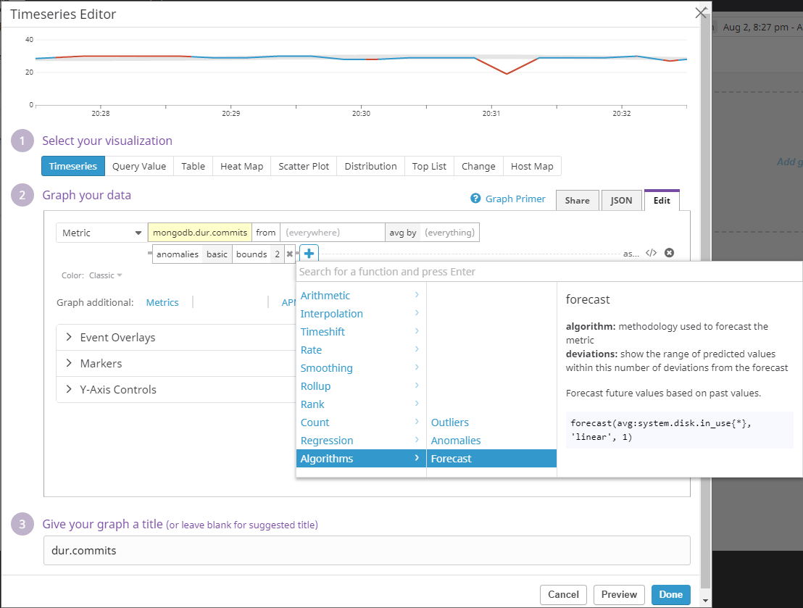  

**- Your custom metric with the rollup function applied to sum up all the points for the past hour into one bucket**
	
  Included in Torrance Handy Dandy Dashboard snapshot.  
	
**- Please be sure, when submitting your hiring challenge, to include the script that you've used to create this Timeboard.**
	
  Script to create dashboard uploaded with the name: createdash.py
	
**Once this is created, access the Dashboard from your Dashboard List in the UI:**
	**- Set the Timeboard's timeframe to the past 5 minutes**
		
This one took me a while to figure out.
		Zoom in on time is done like this….
Alt + [  to zoom out  and alt + ]  to in the time frame. 
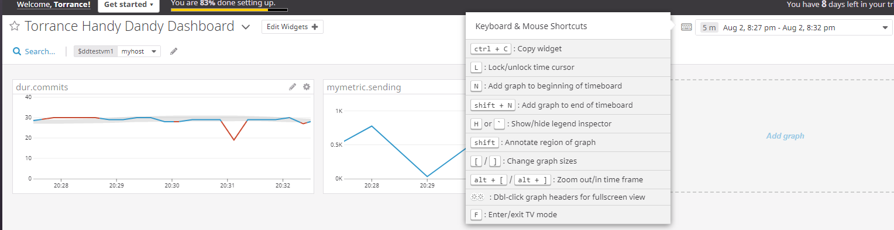

**- Take a snapshot of this graph and use the @ notation to send it to yourself.**

snapshot  

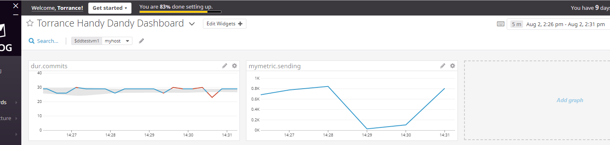   

***
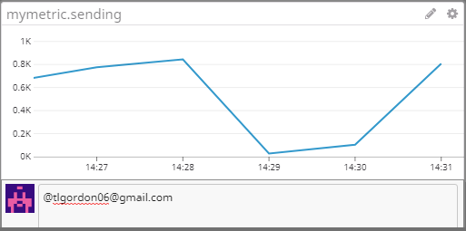  
***
snapshot of the actual email    
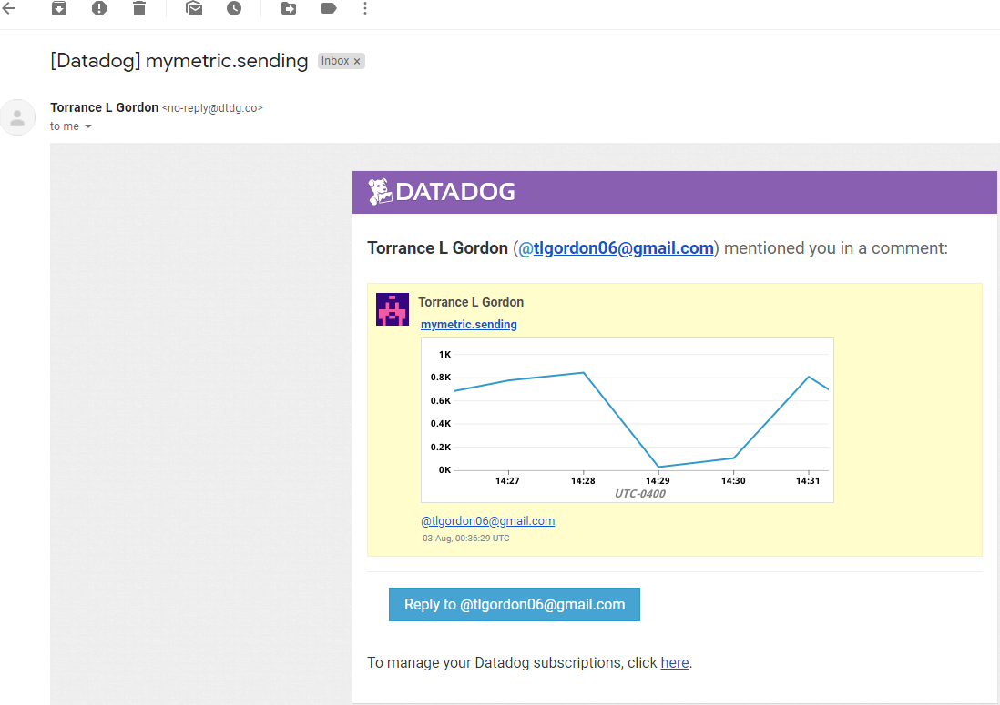  

**- Bonus Question What is the Anomaly graph displaying**

With the "Bounds" variable set as 2, the graph puts a shadow along the line formed by the graphed data. 
The shadow symbolizes 2 standard deviations limit or how dispersed the graph data is allowed to be before a data point is considered abnormal. If a specific data point causes the line to fall outside of the standard deviation, the graph line segment is given a different color. These abnormal values and the line segment they create can be considered anomalies. This is information that can be used for alerts and troubleshooting.

***
### Monitoring Data  

**- Create a new Metric Monitor that watches the average of your custom metric (my_metric) and will alert if it’s above the following values**

**over the past 5 minutes**

**-   Warning threshold of 500**
    
**-   Alerting threshold of 800**
    
**- And also ensure that it will notify you if there is No Data for this query over the past 10m.**  

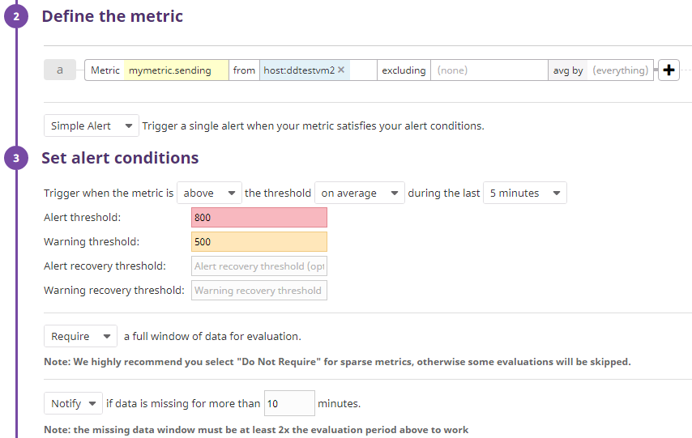

**- Please configure the monitor’s message so that it will:**

**- Send you an email whenever the monitor triggers.**

**-  Create different messages based on whether the monitor is in an Alert, Warning, or No Data state.**

See the saywhatshap  text file uploaded to githup.  

**- Include the metric value that caused the monitor to trigger and host ip when the Monitor triggers an Alert state.**

**- When this monitor sends you an email notification, take a screenshot of the email that it sends you.**  

 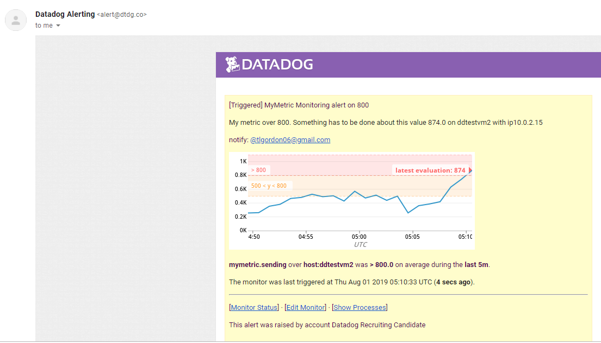  
 ***
 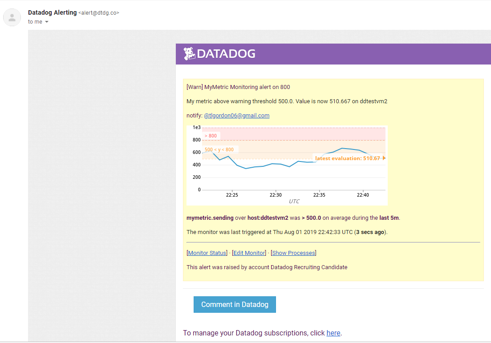

**- Bonus Question: Since this monitor is going to alert pretty often, you don’t want to be alerted when you are out of the office. Set up two scheduled downtimes for this monitor:**  

One that silences it from 7pm to 9am daily on M-F,
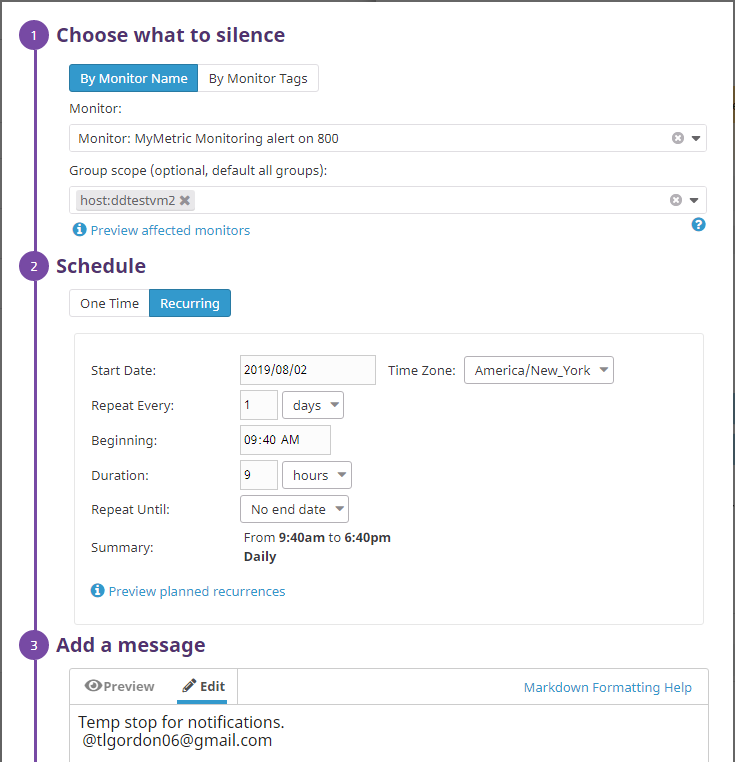  
***
And one that silences it all day on Sat-Sun.  
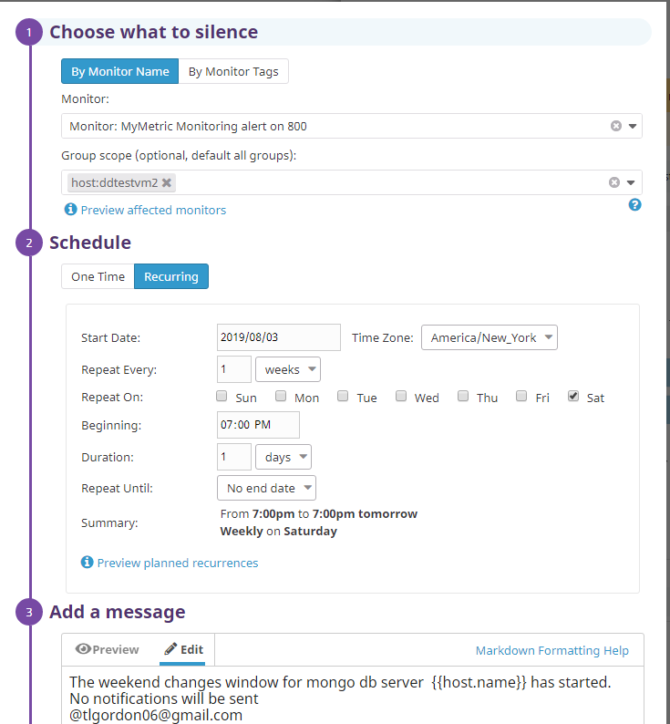

**- Make sure that your email is notified when you schedule the downtime and take a screenshot of that notification.**
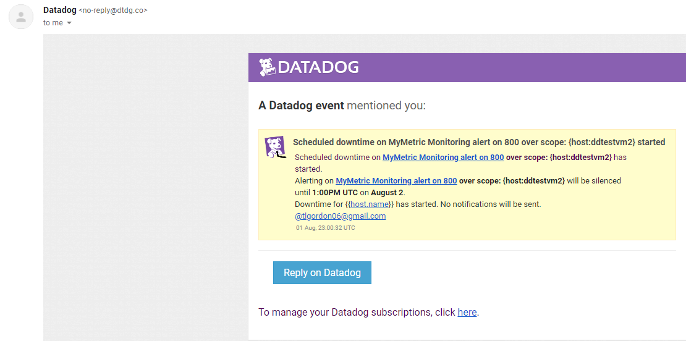  

***
### Collection APM Data  

**- Given the following Flask app (or any Python/Ruby/Go app of your choice) instrument this using Datadog’s APM solution:**
	
	
**- Provide a link and a screenshot of a Dashboard with both APM and Infrastructure Metrics.**

[linktoscreenboard](https://p.datadoghq.com/sb/lcknrqvzb0lud5bs-4ac6a8183b0a00a7f781fca6faa0b203)
***
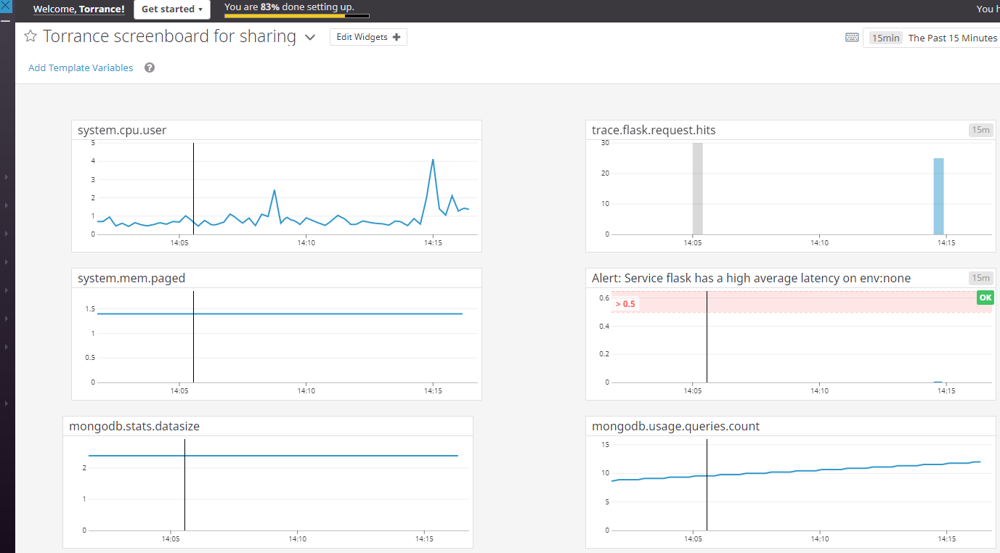  

**- Bonus Question: What is the difference between a Service and a Resource?**
	
**- By datadog definition, "A service is a set of processes that do the same job".  Also by datadog definition, a resource is a particular action for a service**
[linktodatadogdocpage](https://docs.datadoghq.com/tracing/visualization/)  

The main difference I see is the service is the performer and the resource is the performance.  I think of the example of a dedicated server that runs a process that takes XML files and translates it into an API call to software on another server.  The code that translates the XML file is the service.  The API calls it makes to the external software is the resource.

***
### Final Question
**- Is there anything creative you would use Datadog for?**

Situation:  Large research companies process thousands of documents per year for research and government agency review.  These documents are written by a team of researchers and writers. The documents have to be reviewed by a quality control team.  Members of the quality control team are required to review the documents for data accuracy, grammar and corporate standards.   Customizable tools like "Perfect It" will capture possible grammar errors and violations of corporate standards in an instant.  If that data could be captured and monitored,  stakeholders would know where to focus their attention.  This could be an early warning system for process issues in creating documents.
	
Task:  Use datadog to monitor "Perfect It" summary data and graph it over time. The data would have to be adjusted to consider document size and type.  Some documents would have more tables and charts for example.  If the word count is low and the error count is high it would be cause for concern more so than a document with a higher word count.  Even though the errors would still have to be accepted or rejected by human reviewers, the overall process would be more efficient with visual data to highlight problem areas.
	
Desired results: The graphs could be presented to project managers to identify the document types with the most problems and help with identifying ways to drive the numbers down.  Email notifications could be sent on documents that exceed a certain threshold and prompt some audit activity.
